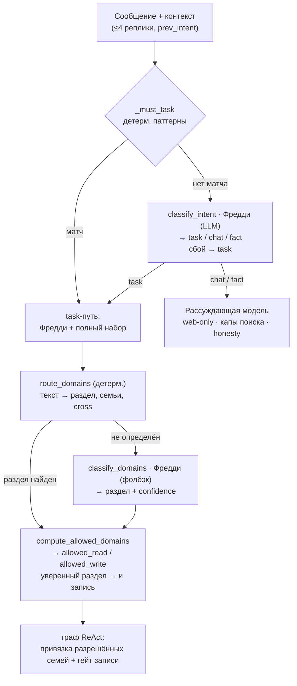

# Preflight-конвейер ReAct (интент + домены)

**Owner:** эпик #191 — harness-обвязка ReAct; интент — #197, домены — #215/#221
**Source code:** `src/sreda/runtime/react_preflight.py` (классификаторы и роутер — отслеживается на актуальность)
**Related code:** `src/sreda/runtime/react_loop.py` (узел `chat`, `_build_graph` — потребление; меняется по многим причинам, freshness НЕ трекаем)
**Tests:** `tests/unit/` — калибровка `_must_task` (`test_must_task_high_precision`), классификаторы интента/доменов, политика `compute_allowed_domains`
**Status:** задеплоено. Флаг `SREDA_REACT_PREFLIGHT_ENABLED` ВКЛ на проде (2026-06-24); доменный роутер #221 — execute глобально. **С 2026-07-08 поверх конвейера на ВСЕХ тенантах работает ЕДИНЫЙ ПУТЬ #285 (`SREDA_REACT_UNIFIED_TENANTS=*`) — см. «Слой 3»: интент-сплит и #221-домены переопределяются единой политикой; слои 1-2 остаются подложкой и полным поведением при откате**
**Verified-against:** `bc200e3` (сверено с кодом 2026-07-16; doc-sync #376 слой-2 — калибровка `classify_checklist_query`: окно overview-фраз `{0,4}` («какие ещё у меня списки» → overview), write-основы `внеси|впиши|зафиксируй` → None; потребители — Срез B cross-check (#213) и сужение read-бинда #376 слой-2 в react_loop)
**Флаги:** `SREDA_REACT_PREFLIGHT_ENABLED` (default `False`); `SREDA_REACT_PREFLIGHT_CHAT_PROVIDER` (default `openrouter-deepseek` — это и есть прод; история: #224 переводил на `gemini-2.5-flash-lite` ради скорости, #257 вернул на `openrouter-deepseek` — gemini-lite зависал); `SREDA_CHECKLIST_UNIFIED` (default `False`) меняет текст checklist-директивы (#213, см. `route_domains`); **`SREDA_REACT_UNIFIED_PATH_ENABLED` + `SREDA_REACT_UNIFIED_TENANTS` (#285)** — единый путь: флаг ON + тенант в списке (`*` = все) → слой 3 переопределяет слои 1-2; флаг OFF или список пуст → byte-identical слоям 1-2

## Зачем это существует

Раньше КАЖДОЕ сообщение шло в полный ReAct-цикл со ВСЕМИ инструментами на ОДНОЙ модели (Фредди). Две беды (#197):

1. На болтовне/викторине модель хватала неподходящие productivity-инструменты и зацикливала поиск → упор в предел проходов → «не получилось довести до конца».
2. Фредди (быстрая диффузионная) слаба на знаниях/рассуждении → выдумывала факты в разговоре.

Идея: **ДО цикла понять намерение** и дать под него (а) нужную МОДЕЛЬ, (б) нужные инструменты. Задаче — быстрый Фредди; разговору/фактам — рассуждающая модель с веб-поиском.

Рефрейм (план #221 v5): **интент `task/chat/fact` — авторитет (#197); домены — надстройка ТОЛЬКО на task-пути** (какие семьи инструментов привязать + можно ли писать). Домен сам по себе НЕ может сделать ход task'ом.

## Обзор конвейера

При `SREDA_REACT_PREFLIGHT_ENABLED=False` весь трафик идёт как раньше (task + полный набор), byte-identical — `effective_intent` читается из state ТОЛЬКО при включённом флаге.

## Слой 1 — интент (#197): намерение → модель

Цель: определить намерение и выбрать модель + класс инструментов на этот ход.

### `_must_task(text, prev_intent=None) -> bool` (слой 0, детерминированный)

- **Вход:** нормализованный текст (lower, дефисы убраны).
- **Логика:** подстрочный матч по узкому high-precision списку `_MUST_TASK_PATTERNS` (явные productivity-команды / обращения к своим данным: `напомни`, `поставь задач`, `мои задачи`, `список покупок`, `запомни`, `что у меня`, …; с #270 — также creation-биграммы категории/раздела памяти: `заведи категор`, `создай раздел`, … — НЕ голое «раздел»/«категория»). Намеренно узко: false-positive = чат зря уйдёт в task и потеряет рассуждающую модель; false-negative безопасен (доедет до LLM-классификатора). `prev_intent` НЕ используется (оставлен для стабильности сигнатуры).
- **Выход:** `True` → сразу `task` (LLM-классификатор не зовётся); `False` → решает слой 1.

### `classify_intent(recent_messages, user_text, prev_intent, freddie_llm, timeout=4.0, raw_sink=None) -> Intent` (слой 1, LLM на Фредди)

- **Вход:** последние ~4 реплики (роль: текст, обрезка 300 симв., `_format_recent`); текущее сообщение; `prev_intent` — **мягкой подсказкой** («Прошлый интент: X. Интент МОЖЕТ смениться — если явно про задачу, ставь task»). Системный промпт `_CLASSIFIER_SYSTEM` требует РОВНО ОДНО слово.
- **Выход:** `Intent = Literal["task", "chat", "fact"]`.
  - `task` — сделать что-то / свои данные (напоминания, задачи, списки, покупки, меню, рецепты, семья, заметки);
  - `fact` — вопрос на общее (публичное) знание о мире;
  - `chat` — болтовня, игра, викторина, смолток, мнение, приветствие.
- **Парс (`_parse_intent`):** первое слово lower ∈ {task,chat,fact}; иначе **fail-open → `task`**.
- **Fail-open:** любой сбой/таймаут/мусор → `task` (лучше быстрый ассистент с инструментами, чем сломать задачу).
- **Наблюдаемость:** `raw_sink` (опц.) собирает сырой ответ модели → трейс `classifier_raw` (#192).

### Роутинг интента → модель + инструменты (узел `chat` в `react_loop`)

Граф строится ОДИН раз с обеими моделями; узел выбирает по `effective_intent` из state.

- **`chat` / `fact`** → рассуждающая модель (`SREDA_REACT_PREFLIGHT_CHAT_PROVIDER`) + **только web-семья** `_WEB_ONLY_TOOL_NAMES = {web_search, fetch_url, get_weather}` + промпт `chat_fact_system_prompt` (honesty, анти-флейл; несёт ЛИЧНОСТЬ Среды — женский род, живой тон «не справка», + слот `persona_overlay`, #242/#121). Honesty-floor (#279): web-only подан как «под рукой в ТЕКУЩЕМ ходе», а НЕ «не умею» — промпт запрещает отрицать способности Среды (напоминания/задачи/списки/память) и велит вместо отказа коротко уточнить недостающее; при этом запрещено утверждать, что действие уже сделано в этом ответе. Инвариант: web-only scope зашит ДО `try`; при сбое рассуждающей модели → fallback на Фредди с **тем же web-only**, НЕ на task.
- **`task`** (или флаг OFF) → Фредди (быстрый) + полный набор инструментов.

Лимит web-инструментов на ход в chat/fact обязателен и задан ПО ИНТЕНТУ (`_SEARCH_CAPS` в `react_loop`, смягчён #215 — прежний единый ≤1 душил факты): `chat` — web_search≤1 / fetch_url≤2, `fact` — web_search≤3 / fetch_url≤3 (fact'у нужно «поиск → открыть → уточнить»); лишние вызовы получают synthetic «лимит поиска исчерпан». Флейл-петля поиска всё равно невозможна (исходный инцидент 2026-06-23 был циклом поиска ×5+): сверху жёсткий потолок — глобальный кап web_search #211 + `_MAX_TURN_PASSES`.

## Слой 2 — домены (#215/#221): раздел → инструменты + право записи

Работает ТОЛЬКО на task-пути. Сужает инструменты по разделу и гейтит запись.

### `route_domains(text) -> RouteResult` (детерминированный, чистая функция)

- **Вход:** текст сообщения.
- **Логика:** токены → разделы по онтологии (`_ontology`, слияние `FAMILY_ROOTS` + `_SEC_*` #215). Домены: `reminders, tasks, checklists, shopping, menu, recipes, household, memory, web`. Longest-match фразы («список покупок» → shopping, «список дел» → checklists); action-домены (глагол: напомни/запомни) приоритетнее content; составное (compound) — только при союзе МЕЖДУ клаузами; направленное кросс-намерение «X из Y» (единственное — «покупки **из** меню»). С #270: creation-фразы категории/раздела памяти (`_MEMORY_CREATION_PHRASES`: «заведи категорию X», «создай раздел памяти», …) → детерминированно `memory`, но ТОЛЬКО если в клаузе нет контент-домена («создай раздел покупок» остаётся shopping); голое «категория» в memory НЕ роутится (общее с shopping).
- **Выход — `RouteResult`:** `primary_domain`, `secondary_domains`, `suppressed_domains`, `compound_by_connector`, `intent_hint` (`"task"` только от task-сигнала #197/#215, иначе `None`), `intent_only`, `active_families` (ленивые семьи на предзагрузку), `directive` (подсказка-промпт раздела; для `checklists` текст флаг-условный: при `SREDA_CHECKLIST_UNIFIED=ON` велит `get_checklist(mode,name)`, #213; при OFF #374-текст РАЗЛИЧАЕТ конкретный список по имени → `show_checklist` от «раздел без имени / какие списки» → `list_checklists`, + оговорка «покупки отдельно → `list_shopping`, не чек-лист». `shopping` собственной директивы НЕ имеет — `None` (#374 R2 пробовал shopping-директиву, откатил: глушила write/compound/cross покупок)), `all_domains`, `cross_intent`.

### `classify_domains(recent_messages, user_text, freddie_llm, timeout=4.0, raw_sink=None) -> DomainClassResult` (LLM-фолбэк на Фредди)

Зовётся ТОЛЬКО когда intent=`task` И `route_domains` не дал детерминированного домена.

- **Вход:** последние реплики + текущее сообщение; системный промпт `_DOMAIN_CLASSIFIER_SYSTEM` (вернуть одно слово-раздел).
- **Выход — `DomainClassResult`:** `domains` (кортеж разделов; пусто = не определил) + `confidence` (`"high"` при РОВНО одном домене / `"low"` при ноль/несколько/сбой). Сбой/таймаут → пусто+`low` (fail-open).

### `compute_allowed_domains(route, classified) -> (frozenset allowed_read, frozenset allowed_write)`

Контракт (Борис 2026-06-29, #263): «**уверенный раздел → можно и писать**»; безопасность УДАЛЕНИЯ держит confirm-гейт (`_confirm_wrap`: `remove_*`/`delete_*`/`cancel_*` спрашивают Да/Нет), а НЕ запрет записи:

- кросс «X из Y» (`cross_intent`) → read оба домена, write — целевой;
- детерминированный ОДИН домен → read + write (явная команда);
- детерминированное СОСТАВНОЕ (≥2, союз) → read оба, **write ∅** (compound-запись → уточнение, не авто-запись — там неоднозначность реальна);
- LLM-фолбэк `high` (ровно один) → **read + write** (изменено #263; раньше read-only «запись не по догадке» — из-за этого «убери куриное филе» терял инструмент удаления и отвечал «нет возможности удалить»);
- иначе (low/мусор/нет домена) → **∅/∅ = явный deny** (только `ask_human`).

Пустой `frozenset` = ЯВНЫЙ запрет; `None` НЕ возвращается (зарезервирован для OFF/legacy в графе).

### Применение в графе

Результат кладётся в state (`router_allowed_read_domains`, `router_allowed_write_domains`, `active_families`); `_apply_domain_policy(...)` фильтрует привязанные инструменты по разрешённым разделам. При выключенном роутере (`allowed = None`) — no-op, byte-identical. В execute-режиме guard НЕ расширяет домены роутера — «роутер побеждает» (#267 A4).

## Слой 3 — единый путь #285 (override поверх слоёв 1-2)

С 2026-07-08 на проде для ВСЕХ тенантов (`SREDA_REACT_UNIFIED_TENANTS=*`). Гейт — `_unified_execute_for(tenant_id)`
(react_loop: флаг И тенант в списке). Идея: НЕ делить трафик на chat/fact/task разными моделями и наборами,
а вести ОДИН путь (Фредди + полный тулсет) с per-turn детерминированной политикой. На unified-ходе:

- **интент принудительно `task`** (`_effective_intent` → "task" во всех 4 узлах; chat/fact-ветка слоя 1 не берётся);
- **политика — `compute_unified_policy(text, route_domains(text))`** (`react_policy.py`): B1-сигналы
  (`react_signals.py`: `write_command_signal` императив / `declarative_memory_signal` / `read_cue_domains`
  щедрый кюс→bounded read) + онтология `route_domains` → `allowed_read`/`allowed_write`; кладётся в те же
  state-каналы `router_allowed_*` (переиспользует #221-машинерию `_apply_domain_policy`);
- **write двухъярусный (B2):** сигнал+продуктивный домен → инструмент напрямую; БЕЗ сигнала → все write-инструменты
  биндятся КАНДИДАТАМИ под универсальный confirm на dispatch (`_apply_unified_policy` → `_generic_confirm_wrap`;
  превью без чтения БД; инвариант «нет молчаливой записи»). Исключение #389: `add_shopping_items`
  (`_UNIFIED_AUTOEXEC_WRITE_TOOLS`, import-time гвард реестра) биндится прямым, если роутер НЕ дал
  КОНКУРИРУЮЩЕГО write-домена (aw ⊆ доменов инструмента; «добавь в список дел купить молоко» →
  aw={checklists} → кандидат+confirm, примиряющий расхождение «роутер vs модель») — прод-трассы показали
  чистое трение confirm'а на продолжении диктовки покупок («1 литр молока», «ещё добавь соль» → оба yes);
  аддитивно/видимо/обратимо; фикс НЕ расширяет autoexec на деструктив (remove_*/clear_* — в общем
  двухъярусном контуре, candidate-confirm при aw=∅ — пред-существующее поведение, не гарантия #389);
- **промпт единый (B4):** task-персона + user-role хвост честности из ФАКТИЧЕСКОГО bound
  (`_unified_availability_directive`, #279-семантика: «под рукой в этом ходе», отмена → «сообщи и остановись»,
  заметку не пересказывать; тон — «ответь ПО СУЩЕСТВУ, опираясь на результаты»);
- **директива раздела** (`route_domains(...).directive`) на unified гейтится по фактически allowed-доменам
  (не зовёт незабинженный тул — иначе петля domain_blocked; + loop-guard `_domain_blocked_count`);
- **паузы (канарейка-фиксы):** новый запрос во время ЖИВОЙ паузы → свежий ход (`_should_redirect_on_pause`:
  confirm — сигнал И НЕ голое эхо «удали»/«ок удали» → иначе A0 «нет»; ask_human — сигнал; сирота tool_call
  закрывается withdrawal-ToolMessage `result_kind=withdrawn`) — #316; confirm-ОТМЕНА → детерминированный
  честный ответ «Отменила, ничего не делаю.» (модель не пере-сочиняет отказ в ложное «удалена») — #321;
  ПРОТУХШАЯ ask_human-пауза + новое сообщение → директива грациозного возврата (`_stale_pause_note`,
  consume-and-clear в chat) — баг «вчерашний вопрос в лоб» убит.
- **Слои 1-2 при этом вычисляются как раньше** (intent-классификатор, #221-роутинг) — их результат на
  unified-ходе переопределяется; при флаге OFF / пустом списке поведение = ровно слои 1-2 (byte-identical).

## Прод-статус и откат

- `SREDA_REACT_PREFLIGHT_ENABLED` — ВКЛ на проде (2026-06-24).
- Доменный роутер #221 — execute-режим глобально (`SREDA_REACT_DOMAIN_SCOPE_MODE=execute`, `SREDA_REACT_DOMAIN_SCOPE_EXECUTE_TENANTS=*`). Откат: `shadow` + `safe_restart`.
- **Единый путь #285 — на ВСЕХ (`SREDA_REACT_UNIFIED_PATH_ENABLED=1`, `SREDA_REACT_UNIFIED_TENANTS=*`,
  с 2026-07-08 16:51 UTC). Откат: сузить `SREDA_REACT_UNIFIED_TENANTS` до канареечных / опустошить (= слои 1-2)
  + `safe_restart`; бэкап env `/etc/sreda/.env.bak-unified-all-20260708-165107`.**
- Детерминированный гейт времени `_text_mentions_time` (#180) сохранён — preflight его дополняет, не заменяет; на разрушающих/приватных путях сбой → уточнение/fail-closed, не no-op.

## Связанное

- Эпик: #191 (harness-обвязка ReAct). **Единый путь: эпик #285 (слой 3; свернул intent-сплит; план
  `plans/chatfact-unify-final.md` в vex-assistant); паузы — #316 (redirect), #321 (честная отмена).**
- Интент: #197. Домены: #215 (карта «слово→раздел»), #221 (ontology-роутер + write-gate), #263 (write при уверенном разделе), #270 (создание категории памяти голосом), #213 (единый `get_checklist` — флаг-условная директива).
- Выбор рассуждающей модели: #173 (eval — честность + скорость), #224 (chat/fact → gemini-2.5-flash-lite), #257 (откат на openrouter-deepseek — gemini-lite зависал). Персона/honesty chat/fact: #242/#121, #251, #279.
- Наблюдаемость: #192 (трейс `classifier_raw`).
- Таксономия семей инструментов: [tool-family-taxonomy.md](./tool-family-taxonomy.md).
